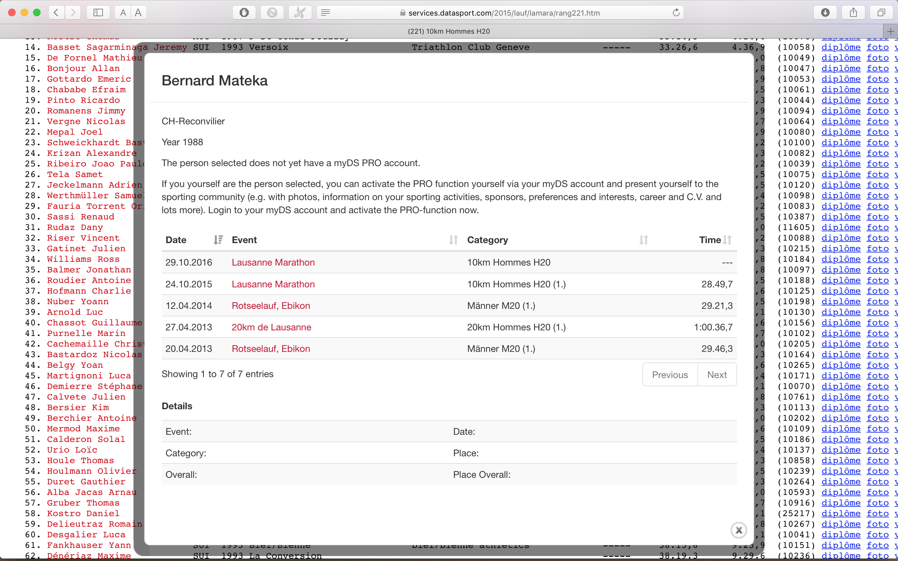

#  [Hop suisse! :)](http://www.kgbanswers.com/what-is-the-english-translation-of-the-phrase-hop-suisse/7476906)

## Project on data analytics for [ADA](http://ada.epfl.ch/) (cs-401) 

---

### Team
[hop_suisse](https://github.com/ggrrll/hop_suisse_ada_project_public)

### Abstract

We will analyse data from [datasport.com](https://www.datasport.com/en/), 
a company that collects results from many sport competitions across Switzerland, for different sport disciplines.   

We will mainly focus on running races, as they are the most popular, and therefore the ones with the largest data volumes.

### Data description

The website has a quite simple interface, 
indeed requiring us to scrape the data from the several html tables present.  
For each competition, the overall ranking is presented, along with the one divided by sex, age categories and teams.   
The following features are present, for each participant:

* name
* age
* city - where s/he's from
* team
* penalty
* time
* delay from the first 
* runner ID
* age / sex category 
* position in the overall ranking 
* average pace - min.sec / Km

(for each participant, a Diploma, a video and a picture were also recorded, that will not be used for our analysis)

We highlight the presence of _longitudinal data_. Namely if one clicks on the athlete's name,
a new window appears, showing his performance in the previous competitions (date, event, age / sex category and time), as shown in the fig. below.

  Example of longitudinal data present in datasport.com 

### Feasibility and Risks

We find this project _quite feasible_, for the time given before the deadline.
The website contains indeed a quite large volume of interesting data, that will allows us to focus more on the challenges related to data analytics and visualization, rather than on the data collection 
(like merging datasets from different websites).
The spatio-temporal  depth of the data will allows us to address several questions on sport habits in Switzerland, better described in the following section.  
The only _risk_ we can foresee now (before actually having explored the dataset) concerns the _sparsity of the longitudinal data_. Namely, a rich time-series of results will  likely be available only for a very small fraction of athletes (and in particular runners). This will probably limit the statistical significance of the analysis of athletes' performance across time.
If the volume of longitudinal data for runners will not be sufficient, we will similarly explore datasets from other sport disciplines, like biking or triathlon, as they also present many events, 
each year.

### Time-plan and Deliverables

#### Week 1: parsing of the races results

We will use with the standard python modules for web scraping, used throughout the homeworks.

#### Weeks 2-3: _exploratory_ data analysis

After the parsing, we will start our data analysis, keeping in mind the work-flow for a correct approach in data analytics outlined in this [paper](http://science.sciencemag.org/content/347/6228/1314), by one of the most currently outstanding statistician.

We will for instance try to find patterns in sport habits, across sex / age categories. 
It will be interesting to compare two main types of analytics, namely supervised and unsupervised learning.

We do not exclude the possibility of looking for interesting correlations 
with data outside datasport.com.
We would like to investigate for instance, how weather conditions might influence performance in sport. For these extra studies, additional data collections will be carried out, using publicly available data sources.

#### Weeks 4-5-6: _inferential_ (and hopefully _predictive_) data analysis

With the help of _machine learning_ techniques, we will try to predict for instance the performance of an athlete (or a group of athletes) in the next race. 

Given that we will likely limit this project to the data present in datasport.com, this study will not reach the level of a  _mechanistic_ (or even _causal_) data analysis (see again the above-mentioned [paper](http://science.sciencemag.org/content/347/6228/1314)), that is rather the goal of a PhD project, for instance. 
This means that, if we will find for example a statistically significant difference in sport activity across sexes (or age categories), we will not be able to explore the (biological, cultural) reasons for such differences. In other words, even if our analysis will (hopefully) accurately _predict_ those patterns, it will definitely not help us figure out the _underlying mechanism_.

#### Weeks 7-8: data visualization 

We aim to build a web page, using interactive data visualization tools, in order to include the findings of our data analysis. 
This will as well  help the users of datasport.com to explore the content of this website, since the current interface is  even lacking summarizing statistics.

